<div align="center">



<br/>


# OldMacBro

### Your 2017 MacBook Air isn't slow. It's just carrying too much.
**OldMacBro finds what's weighing it down and takes it off, in one click.**

<a href="https://github.com/gyuv/oldmacbro/releases/latest">
  
</a>

<sub>Free · Native Swift · No Electron · Tuned for the MacBook Air 13" (2017) · Native on Apple Silicon too</sub>

<sub>by <b>Uv</b> · <a href="https://github.com/gyuv">@gyuv</a></sub>

</div>

<br/>

> [!NOTE]
> This repository hosts **downloads, documentation and issue tracking** for OldMacBro. The source code is closed. See [About this repository](#-about-this-repository).

---

## 📑 Contents

- [Download & install](#-download--install)
- [Which edition do I need?](#-which-edition-do-i-need)
- [Features](#-features)
- [Why native?](#-why-native)
- [Requirements](#-requirements)
- [Safety promises](#-safety-promises)
- [FAQ](#-faq)
- [Changelog](CHANGELOG.md)
- [Reporting bugs](#-reporting-bugs--requesting-features)
- [About this repository](#-about-this-repository)

---

## ⬇️ Download & install

1. **Download** the right edition from the **[Releases page](https://github.com/gyuv/oldmacbro/releases/latest)**: `OldMacBro-x.y.z-Intel.dmg` or `OldMacBro-x.y.z-AppleSilicon.dmg`. See [Which edition do I need?](#-which-edition-do-i-need)
2. **Open** the DMG and drag **OldMacBro** onto **Applications**.
3. **First launch:** right-click **OldMacBro.app** and choose **Open**, then **Open** again.<br/>
   <sub>You only do this once. The app is ad-hoc signed and doesn't come from the App Store, so Gatekeeper asks first.</sub>
4. Click the **chip icon** in your menu bar, then **⚡ Smart Boost**. Done.

<details>
<summary><b>Recommended one-time setup</b></summary>
<br/>

- **Settings → Privileged Helper → Install.** One password prompt lets OldMacBro control the fans, toggle Turbo Boost and run admin clean-ups without asking every time.
- **Tweaks → Apply recommended** for a permanently snappier feel.
- **Uninstaller blocked by macOS?** Allow OldMacBro in **System Settings → Privacy & Security → Full Disk Access**, and **App Management** on macOS 13 or later.
</details>

<details>
<summary><b>Updating</b></summary>
<br/>

Quit OldMacBro (menu bar → ⏻), drag the new version into **Applications** and choose **Replace**. Your settings, widget positions and Silent Mode backups are kept.
</details>

<details>
<summary><b>Verifying your download (optional)</b></summary>
<br/>

Each release lists a SHA-256 checksum. Compare it with:

```bash
shasum -a 256 ~/Downloads/OldMacBro-*.dmg
```
</details>

---

## 🧭 Which edition do I need?

Click the Apple menu  → **About This Mac**:

| You see | Download | Built for |
|---|---|---|
| **Processor:** Intel Core … | `OldMacBro-x.y.z-Intel.dmg` | x86_64, tuned for the MacBook Air 2017 |
| **Chip:** Apple M1, M2, M3 or M4 | `OldMacBro-x.y.z-AppleSilicon.dmg` | Native arm64, no Rosetta |

<sub>Two editions ship starting with v1.4.0. Releases up to v1.3.0 have a single Intel DMG.</sub>

---

## ✨ Features

### 🍏 Menu bar

<table>
<tr>
<td width="440" valign="top">

</td>
<td valign="top">

- **Live status item** with CPU %, temperature and RAM. The glyph changes colour as the Mac heats up.
- **Popover** with three rings (CPU · RAM · Temp), a bar per core and a fan-profile switch.
- **Quick actions:** Purge RAM, Flush DNS, Quick Clean and Silent Mode.
- **Right-click** for the full action menu.

<sub>🟢 healthy · 🟠 busy · 🔴 needs attention</sub>

</td>
</tr>
</table>

### ⚡ Smart Boost: the one-click lag fix



Smart Boost works out **why** your Mac is lagging right now and fixes that cause:

| Problem it detects | What it does |
|---|---|
| Idle apps hogging memory | Quits them **gracefully** (apps with unsaved work show their normal "Save changes?" prompt) |
| Running hot | Boosts the fans |
| Low disk space | Helps you clear space |
| GPU struggling | Applies light visuals |

Results appear as an **Overview card with Fix buttons**. It never force-kills an app and never deletes caches without asking.

### 🎛 Control Center



A dark HUD window whose **ambient lighting reacts to CPU heat**.

| Tab | What's inside |
|---|---|
| **Overview** | Health summary, Smart Boost card and one-click fixes |
| **Processes** | Classifies browser and Electron helpers and zombies. **Lower Priority**, **Terminate**, **Force Kill** or **Freeze** (frozen processes resume after 10 minutes or on next launch; no bulk freeze) |
| **Deep Clean** | Caches, logs, Xcode DerivedData, browser caches, orphaned Application Support, Trash and APFS snapshots |
| **Tweaks** | Turn off window animations, speed up Dock and Mission Control, reduce transparency and motion, force App Nap, Low Power Mode, flush DNS and more |
| **Startup** | Audits LaunchAgents, LaunchDaemons and Login Items. **Silent Mode** turns off auto-updaters (Google, Adobe, …) and saves a JSON backup so you can restore them |
| **Thermals** | Every SMC sensor plus fan RPM and fan profiles |
| **Battery** | Cycle count, design vs. full capacity, voltage, watts and temperature |
| **Settings** | Helper install, refresh rates, widgets and appearance |

### 🗑 Uninstaller

Removes apps **together with their hidden data** in `~/Library`, finds leftovers from apps you deleted long ago, and surfaces large forgotten files. Everything goes to the **Trash**, so nothing is lost by accident.

### 🌡 Telemetry & fans

- **CPU:** load per core, PMU speed limit and `thermalState`.
- **SMC sensors:** PECI, CPU die, proximity, heatsink, exhaust, PCH, palm rest and battery.
- **Fans:** current, min, max and target RPM.

| Fan profile | Behaviour |
|---|---|
| **Auto** | Apple's default control |
| **Balanced** | Targets 75 °C |
| **Aggressive Cooling** | Targets 65 °C |
| **Full Blast** | Maximum RPM |
| **Manual** | You pick the speed |

Fan control is **handed back to macOS automatically when OldMacBro quits.**

### 🧠 Memory

Active, wired, compressed, cached, free, swap and memory pressure. Colours follow **pressure**, not how full RAM is, because a full-but-healthy Mac is normal on macOS.

### 🔋 Power

- **Low Power Profile** moves background apps into the Darwin background band (`PRIO_DARWIN_BG`), so the app you're using gets the CPU.
- **Turbo Boost switch** *(Intel edition)* disables Turbo Boost to keep a hot dual-core Broadwell cool and quiet. It uses the signed kext shipped with [Turbo Boost Switcher](https://github.com/rugarciap/Turbo-Boost-Switcher).

### 🍎 Apple Silicon edition

Native arm64, with features made for M-series Macs:

- **P-core / E-core readings** instead of a clock speed, which Apple Silicon doesn't expose to apps.
- **M-series SMC sensors** for real chip temperatures.
- **Fanless-aware Thermals** that make sense on a MacBook Air M1–M4 with no fan.
- **Rosetta detection** in Smart Boost: spots apps running slowly as translated Intel code.
- **Intel-only apps filter** in the Uninstaller, to find apps that still need Rosetta.

### 🖥 Live Dock icon & desktop widgets

- **Dock icon** with three live rings (CPU, RAM, temp), a **badge when the CPU throttles**, and a Dock menu with quick actions.
- **Desktop widgets:** CPU, Memory, Thermal and Battery glass panels. Drag them anywhere, pin them to the desktop or let them float; they remember their positions.

---

## 🛠 Why native?

Most "Mac cleaner" and system-monitor apps are web pages in a box. On an 8 GB, dual-core 2017 MacBook Air, that box *is* the lag.

| | **OldMacBro** | Typical Electron utility |
|---|---|---|
| UI framework | Swift · AppKit · SwiftUI | Chromium + Node.js |
| CPU architecture | Separate native builds for Intel and Apple Silicon | Often one Intel build run through Rosetta |
| Web views | **None** | The whole app |
| Third-party dependencies | **Zero** | Hundreds of npm packages |
| Hardware access | Direct, via a ~250-line C bridge to the Apple SMC | Shelling out to CLI tools |
| Idle footprint | Tiny, tuned for 8 GB machines | Often several hundred MB |

- **Made for weak GPUs like the Intel HD Graphics 6000.** Animations are cheap, readings update gently, and windows release their memory when closed.
- **Talks to the hardware directly.** Temperatures and fan speeds come straight from the SMC, not from guesses.
- **Nothing phones home.** No telemetry, analytics or accounts. Your data stays on your Mac.

---

## 💻 Requirements

| | |
|---|---|
| **Tuned for** | MacBook Air 13" (2017, `MacBookAir7,2`): dual-core Broadwell i5/i7, Intel HD Graphics 6000, 8 GB LPDDR3 |
| **Also works on** | Most Intel (x86_64) Macs |
| **Apple Silicon** | M1, M2, M3 and M4 Macs, with the Apple Silicon edition |
| **macOS** | Monterey (12) or newer, including newer versions installed through [OpenCore Legacy Patcher](https://dortania.github.io/OpenCore-Legacy-Patcher/) |

---

## 🛡 Safety promises

- **Nothing is deleted without you seeing it first.** Removed items go to the **Trash**.
- **Your active app is never touched.** Boosts and watchers ignore whatever you're working in.
- **Nothing stays frozen.** Paused processes resume after 10 minutes, and whenever OldMacBro starts.
- **Everything is reversible.** Silent Mode, tweaks and fan profiles all restore with one click.
- **Apple is back in charge on quit.** Fan control reverts to macOS automatically.

---

## ❓ FAQ

<details>
<summary><b>Will Smart Boost close something I'm working on?</b></summary>
<br/>
No. It only looks at apps you haven't used for the idle time you choose (20 minutes by default), never the app in front. Apps with unsaved work show their normal save prompt.
</details>

<details>
<summary><b>An app stopped responding after I used Processes.</b></summary>
<br/>
Open the menu bar panel and click <b>▶ Resume Frozen</b>, or use <b>Resume all now</b> in Processes. OldMacBro also resumes anything it froze after 10 minutes and every time it launches.
</details>

<details>
<summary><b>Do I need the privileged helper?</b></summary>
<br/>
Only for fan control, Turbo Boost, Low Power Mode and cleaning system folders. Everything else works without it, and you can remove it any time from Settings.
</details>

<details>
<summary><b>Does it work on Apple Silicon?</b></summary>
<br/>
Yes. From v1.4.0, every release has two editions. The <b>Intel</b> edition is tuned for the 2017 MacBook Air (Turbo Boost control, fan curves, Broadwell-aware Smart Boost). The <b>Apple Silicon</b> edition is native arm64 and adds P-core/E-core readings, M-series sensors, fanless-aware Thermals, Rosetta detection and an Intel-only apps filter.
</details>

<details>
<summary><b>I downloaded the wrong edition.</b></summary>
<br/>
Quit OldMacBro, delete it from Applications, and install the other DMG. An Intel build would still run on Apple Silicon through Rosetta, just slower and without the M-series features.
</details>

<details>
<summary><b>macOS says the app "can't be opened" or is "damaged".</b></summary>
<br/>
Right-click the app and choose <b>Open</b>. If that doesn't help, run <code>xattr -dr com.apple.quarantine /Applications/OldMacBro.app</code> in Terminal and open it again.
</details>

<details>
<summary><b>Is the source code available?</b></summary>
<br/>
No. OldMacBro is free to download and use, but the source is private. This repository is for releases, documentation and issues only.
</details>

---

## 🐞 Reporting bugs & requesting features

Use **[Issues](https://github.com/gyuv/oldmacbro/issues/new/choose)**. For bugs, please include:

- Mac model and chip (Apple menu → About This Mac), macOS version, and whether you use OCLP
- Which edition you installed (Intel or Apple Silicon)
- OldMacBro version (menu bar → right-click → About)
- Steps to reproduce, and a screenshot if possible

---

## 📦 About this repository

> [!IMPORTANT]
> **This is a distribution repository. The source code is closed and private.**
>
> This repo contains only the README, documentation images and compiled releases. It exists so you can **download OldMacBro**, **read about it**, and **report issues**. Pull requests with code changes can't be accepted here.

OldMacBro is **free** to download and use. Redistributing, modifying, decompiling or reselling the app is not permitted without written permission from the author. OldMacBro is provided **as is**, with no warranty. It changes fan speeds, process priorities and system settings, so you use it at your own risk.

*OldMacBro is not affiliated with or endorsed by Apple Inc. Mac, MacBook Air and macOS are trademarks of Apple Inc. Intel and Turbo Boost are trademarks of Intel Corporation.*

---

<div align="center">

### Made with ❤️ for Intel Macs that deserve a second life, and Apple Silicon Macs that deserve to stay fast

**Uv** · [github.com/gyuv](https://github.com/gyuv)

<sub>If OldMacBro gave your Mac a second life, a ⭐ on this repo helps others find it.</sub>

</div>
